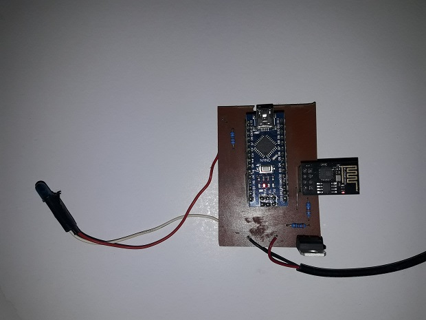
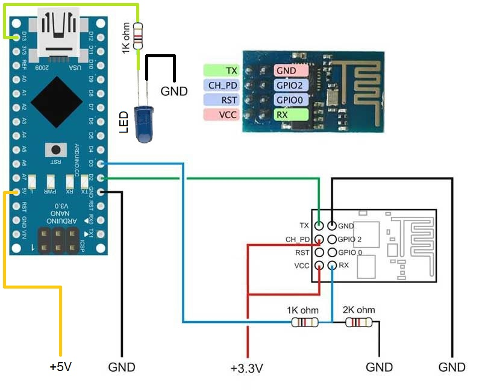

# WiFi2IR-project
Duplicate IR remote controller commands via WiFi. 

This project allows to extend an IR control remote funtionalities with an android cellular phone App / using Arduino Nano/ESP8266 and IR LED.
This is a project for investigation purposes only.

## Background

Just to explain in details the scope of this project.

At home I have two floors and I have one TV decoder connected to a TV set on the ground floor ; but due to the decoder have an additional A/V output I've tried to transmit the TV signal to the first floor TV set.

I did it ....

So now I have one TV decoder connected to two ore more TV sets , but ONLY ONE REMOTE CONTROLLER.

Anyway ; when I watching TV on the first floor everytime I have to change the TV channel; I have to go down the stairs and change the channel; or just stay watching the same channel , over and over ...

Well the idea it was to use an android App on my cell phone with buttons equivalent to the original decoder remote controller ; send the comunications using Wi Fi , then receive the information in an ESP2866 WiFi and send it to an Arduino NANO connected to an IR LED.

## Schematics

The ESP8266 needs a 3.3V power supply; due to the high current needed to work; it is not possible to use the 3.3V output of Arduino NANO.

In this project I used a 5V power supply and LM317 to reduce the voltage to 3.3 having a common ground between them.

Due to this power supply difference; the ESP8266 input RX have to be connected to a voltage divider in order to reduce 5V from Arduino to aproximately 3V on the ESP side.   

